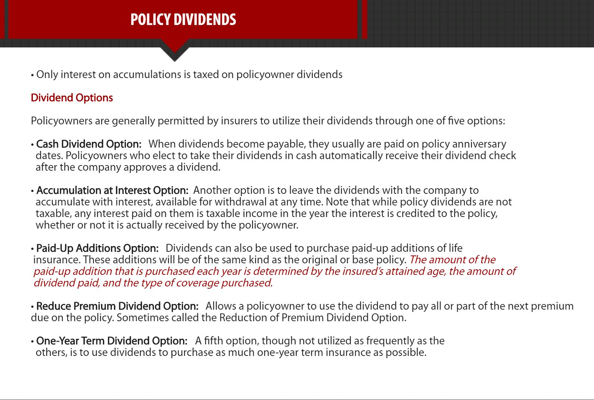
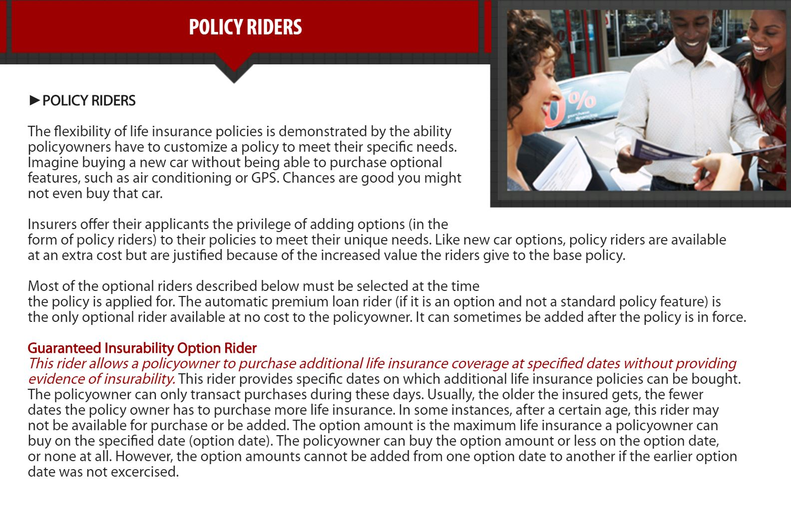

Chapter4. Life Insurance Policies - Provisions, Options and Riders
===============================================================================

TYPES OF POLICIES
-------------------------------------------------------------------------------
Keywords:

- `Ordinary Life Insurance <Ordinary Life_>`_
- `Group Life Insurance <Group Insurance_>`_
- `Term Life Insurance <Term Life Insurance_>`_
- `Option to Renew <Option to Renew_>`_
- `Option to Convert <Option to Convert_>`_
- `Whole Life Insurance <Whole Life Insurance_>`_
- `Cash Value <Cash Values_>`_
- `Endowment Policy <Endowments_>`_
- `Family Income Policies <Family Income Policies_>`_
- `Joint Life Policy <Joint Life Policies_>`_
- `Joint Life Survivor <Joint Life and Survivor Policies_>`_
- `Juvenile Insurance <Juvenile Insurance_>`_
- `Credit Life Insurance <Credit Life Insurance_>`_
- `Adjustable Life <Adjustable Life_>`_
- `Universal Life <Universal Life_>`_
- `Variable Insurance <Variable Insurance Products_>`_

Life insurers issue three basic kinds of coverage: ordinary insurance,
industrial insurance, and group insurance. Many companies offer all. Some companies specialize in one or another. These coverages are distinguished by types of customers, amounts of insurance written, underwriting standards, and marketing practices.

Ordinary Life
~~~~~~~~~~~~~~~~~~~~~~~~~~~~~~~~~~~~~~~~~~~~~~~~~~~~~~~~~~~~~~~~~~~~~~~~~~~~~~~
Ordinary life insurance is individual life insurance that includes many types of temporary and permanent insurance protection plans written on individuals. Premiums are normally paid monthly, quarterly, semiannually, or annually. Ordinary life insurance is the principal type of life insurance purchased in the United States and includes such types of insurance as whole, term, universal, and variable life coverage as well as endowment policies.

Industrial Insurance
~~~~~~~~~~~~~~~~~~~~~~~~~~~~~~~~~~~~~~~~~~~~~~~~~~~~~~~~~~~~~~~~~~~~~~~~~~~~~~~
**Industrial life insurance is characterized by comparatively small issue amounts, such as $1,000**, with premiums collected on a weekly or monthly basis by the agent at the policyowner's home. **Quite often it is marketed and purchased as burial insurance**.

Group Insurance
~~~~~~~~~~~~~~~~~~~~~~~~~~~~~~~~~~~~~~~~~~~~~~~~~~~~~~~~~~~~~~~~~~~~~~~~~~~~~~~
Group life insurance is written for employer, employee groups, associations, unions, and creditors to provide coverage for a number of individuals under one contract. Underwriting is based on the group, not the individuals who are insured. Group insurance, which has grown tremendously over the past few decades, will be discussed in detail later.

Keep in mind that the coverages previously described are general categories of insurance. Let's turn our attention now to the various life insurance plans: term, whole life (or permanent), and endowment.

Term Life Insurance
~~~~~~~~~~~~~~~~~~~~~~~~~~~~~~~~~~~~~~~~~~~~~~~~~~~~~~~~~~~~~~~~~~~~~~~~~~~~~~~
Term life insurance is the simplest type of life insurance plan. **Term life provides low-cost insurance protection for a specified period (or term) and pays a benefit only if the insured dies during that period**. For example, assume Steve purchases a 20-year $50,000 level term policy on his life, naming his sister, Amy, the beneficiary. If Steve dies at any time within the policy's 20-year period, Amy will receive the $50,000 death benefit. If Steve lives beyond that period, nothing is payable. The policy’s term has expired. If Steve cancels or lapses the policy during the 20-year term, nothing is payable. **Term policies do not build cash values**.

• **One advantage of term life insurance is the initial premium is lower than for an equivalent amount of whole life insurance**. 
• **Term life provides the greatest amount of death benefit per dollar of initial cash outlay**.

Term life is also called temporary life insurance since it provides protection for a temporary period of time. The period for which these policies are issued can be defined in terms of years (1-year term, 5-year term, or 20-year term, for example) or in terms of age (term to age 45, term to age 55, term to age 70, for example). **Term policies issued for a specified number of years provide coverage from their issue date until the end of the years so
specified. Term policies issued until a certain age provide coverage from their date of issue until the insured reaches the specified age.**

Basic Forms of Term life
~~~~~~~~~~~~~~~~~~~~~~~~~~~~~~~~~~~~~~~~~~~~~~~~~~~~~~~~~~~~~~~~~~~~~~~~~~~~~~~
There are a number of forms of term life insurance that insurers offer. These forms, distinguished primarily by the amount of benefit payable, are known generally as **level term, decreasing term, and increasing term**.

Level Term Insurance
~~~~~~~~~~~~~~~~~~~~~~~~~~~~~~~~~~~~~~~~~~~~~~~~~~~~~~~~~~~~~~~~~~~~~~~~~~~~~~~
Level term insurance provides a level amount of protection for a specified period, after which the policy expires.

Level term policies are able to offer level premiums because the premiums are averaged over the term of the policy. A $100,000 10-year level term policy, for example, provides a straight, level $100,000 of coverage for a period of 10 years. A $250,000 term to age 65 policy provides a straight $250,000 of coverage until the insured reaches age 65. If the insured under the $100,000 policy dies at any time within those 10 years, or if the insured under the $250,000 policy dies prior to age 65, the insured's beneficiaries will receive the policy's face amount benefits.
If the insured lives beyond the 10-year period or past age 65, the policies expire and no benefits are payable.

指在A年之前死亡, 保额是X; 在B年之前死亡, 保额是Y; 到期后保额为0。

Decreasing Term Insurance
~~~~~~~~~~~~~~~~~~~~~~~~~~~~~~~~~~~~~~~~~~~~~~~~~~~~~~~~~~~~~~~~~~~~~~~~~~~~~~~
Decreasing term policies are characterized by benefit amounts that **decrease gradually** over the term of protection and have **level premiums**. A 20-year $50,000 decreasing term policy, for instance, will pay a death benefit of $50,000 at the beginning of the policy term. That amount gradually declines over the 20-year term and reaches $0 at the end of the term. 

• **Credit life insurance, sold to cover the outstanding balance on a loan, is based on decreasing term insurance** (Credit Life也是Decreasing Term的一种).

• **Decreasing term insurance is commonly used to protect an insured’s mortgage** （通常用于保护贷款, 因为贷款在开始需要保额, 最后不需要保额).

Increasing Term Insurance
~~~~~~~~~~~~~~~~~~~~~~~~~~~~~~~~~~~~~~~~~~~~~~~~~~~~~~~~~~~~~~~~~~~~~~~~~~~~~~~
Increasing term insurance is term insurance that provides a death benefit that increases at periodic intervals over the policy's term. **The amount of increase is usually stated as specific amounts or as a percentage of the original amount**. It may also be **tied to a cost of living index, such as the Consumer Price Index**. Increasing term insurance may be sold as a separate policy, but is usually purchased as a cost of living rider to a policy (通常为了保证生活开支).

Features of Term Life
~~~~~~~~~~~~~~~~~~~~~~~~~~~~~~~~~~~~~~~~~~~~~~~~~~~~~~~~~~~~~~~~~~~~~~~~~~~~~~~
Term policies are issued for a specified period, defined in terms of years or age. Most contain two options that can extend the coverage period. These are the option to renew and the option to convert the policy.

Option to Renew
~~~~~~~~~~~~~~~~~~~~~~~~~~~~~~~~~~~~~~~~~~~~~~~~~~~~~~~~~~~~~~~~~~~~~~~~~~~~~~~
**A guaranteed renewable policy allows the policyowner to renew the term policy before its expiration date, without having to provide evidence of insurability (that is, without having to prove good health)**. For example, a five year renewable term policy permits the policyowner to renew the same coverage for another five years at the end of the first five-year term. **The premiums for the renewal period will be higher than the initial period**, reflecting the insurer's increased risk. Renewal options with most term policies typically provide for several renewal periods or for renewals until a specified age. The advantage of the renewal option is that it allows the insured to continue insurance protection, even if the insured has become uninsurable.

A common type of renewable term insurance is annually renewable term (ART). This is also called yearly renewable term, or YRT. Essentially, this type of policy represents the most basic form of life insurance. It provides coverage for one year and allows the policyowner to renew coverage each year, without evidence of insurability.

Option to Convert
~~~~~~~~~~~~~~~~~~~~~~~~~~~~~~~~~~~~~~~~~~~~~~~~~~~~~~~~~~~~~~~~~~~~~~~~~~~~~~~
The second option common to most term plans is the option to convert. **The option to convert gives the insured the right to convert or exchange the term policy for a whole life (or permanent) plan without evidence of insurability**. This exchange involves the issuance of a whole life policy at a premium rate reflecting the insured's age at either the time of the conversion (**the attained age method**) or at the time when the original term policy was taken out (**the original age method**). The option to convert generally specifies a time limit for converting, such as 10 years in force or at age 55, whichever is later.

• **The cost of insurance** is most important when an insured owner is trying to decide whether to convert term insurance at the insured's **original age** or the insured's **attained age**.

The option to convert and the option to renew can be (and typically are) combined into a single term policy. For instance, a 10-year convertible renewable policy could provide for renewals until age 65 and be convertible any time prior to age 55.

Whole Life Insurance
~~~~~~~~~~~~~~~~~~~~~~~~~~~~~~~~~~~~~~~~~~~~~~~~~~~~~~~~~~~~~~~~~~~~~~~~~~~~~~~
A second type of life insurance plan is whole life insurance (also known as permanent insurance). **Whole life insurance is called this because it provides permanent protection for one’s entire life-from the date of issue to the date of the insured's death**. The benefit payable is the face amount of the policy, which **remains constant throughout the policy's life (Whole Life的保额不会变化). Premiums are set at the time of policy issue, and they too remain level for the policy's life**.

Features of Whole life
~~~~~~~~~~~~~~~~~~~~~~~~~~~~~~~~~~~~~~~~~~~~~~~~~~~~~~~~~~~~~~~~~~~~~~~~~~~~~~~
There are certain features of whole life insurance that distinguish it from term insurance: **cash values and maturity at age 100**. These two features combine to produce living benefits to the policyowner.

Cash Values
~~~~~~~~~~~~~~~~~~~~~~~~~~~~~~~~~~~~~~~~~~~~~~~~~~~~~~~~~~~~~~~~~~~~~~~~~~~~~~~
Unlike term insurance, which provides only death protection, whole life insurance combines insurance protection with a savings element. This accumulation, commonly referred to as the policy’s cash value, builds over the life of the policy. This is because whole life insurance plans are credited with a certain guaranteed rate of interest. This interest is credited to the policy on a regular basis and grows over time. Income taxes may be due when the policy is surrendered.

Though it is an important part of funding the policy, **the cash value is often regarded as a savings element because it represents the amount of money the policyowner will receive if the policy is ever surrendered**. It is often called the cash surrender value. This value is a result of the way premiums are calculated and interest is paid, as well as the policy reserves that build under this system.

The amount of a policy's cash value depends on a variety of factors, including:

• The face amount of the policy
• The duration and amount of the premium payments
• How long the policy has been in force

**The larger the face amount of the policy, the larger the cash values. The shorter the premium-payment period, the quicker the cash values grow**. The longer the policy has been in force, the greater the build-up in cash values. The reason for these things can be clarified with an understanding of the maturity of a whole life policy.

Maturity at Age 100
~~~~~~~~~~~~~~~~~~~~~~~~~~~~~~~~~~~~~~~~~~~~~~~~~~~~~~~~~~~~~~~~~~~~~~~~~~~~~~~
Whole life insurance is designed to mature at age 100. The significance of age 100 is that, as an actuarial assumption, every insured is presumed to be dead by then. (While some people live beyond age 100, the number of people who do live that long is not a statistically significant portion of the population.) Consequently, the premium rate for whole life insurance is based on the assumption that the policyowner (usually the insured) will be paying premiums for the whole of life, to the insured’s age 100. At age 100, the cash value of the policy has accumulated to the point that it equals the face amount of the policy, as it was actuarially designed to do. At that point, the policy has completely matured or endowed. No more premiums are owed. The policy is completely paid up.

For those lucky insureds that live to age 100, the insurance company will issue checks for the full value of their policies. Practically speaking, very few people live to age 100. It's far more likely that a whole life policy will be cashed in for its surrender value or that its face amount will be paid out as a death benefit prior to maturity.

Living Benefits
~~~~~~~~~~~~~~~~~~~~~~~~~~~~~~~~~~~~~~~~~~~~~~~~~~~~~~~~~~~~~~~~~~~~~~~~~~~~~~~
Another unique feature of whole life insurance is the living benefits it can provide. Through the cash value accumulation build-up in the policy, a policyowner has a ready source of funds that may be borrowed at reasonable rates of interest. These funds may be used for a personal or business emergency. For example, they could be used to help pay for a child's education or to pay off a mortgage. It is not a requirement of the policy that the loan be repaid. However, **if a loan is outstanding at the time the insured dies, the amount of the loan plus any interest due will be subtracted from the death benefit before it is paid**.

Cash values belong to the policyowner. The insurance company cannot lay claim to these values. This concept is discussed in more detail later, under "Nonforfeiture Values."

Whole Life Premiums
~~~~~~~~~~~~~~~~~~~~~~~~~~~~~~~~~~~~~~~~~~~~~~~~~~~~~~~~~~~~~~~~~~~~~~~~~~~~~~~
As noted, whole life is designed as if the insured will live to age 100. Accordingly, the amount of premium for a whole life policy is calculated, in part, on the basis of the number of years between the insured's age at issue and age 100. **The shorter the payment period, the higher the premium**. This time span represents the full premium-paying period, with the amount of the premium spread equally over that period. This is known as the level premium approach. As is the case with level premium term insurance, **this approach allows whole life insurance premiums to remain level rather than increase each year with the insured’s age**.

Basic Forms of Whole Life
~~~~~~~~~~~~~~~~~~~~~~~~~~~~~~~~~~~~~~~~~~~~~~~~~~~~~~~~~~~~~~~~~~~~~~~~~~~~~~~
Just because whole life premiums are calculated as if they were payable to age 100, they do not necessarily have to be paid this way. Whole life is flexible and a number of policy types have been developed to accommodate different premium-paying periods. Three notable forms of whole life plans are straight whole life, limited pay whole life, and single premium whole life.

Straight Whole Life
~~~~~~~~~~~~~~~~~~~~~~~~~~~~~~~~~~~~~~~~~~~~~~~~~~~~~~~~~~~~~~~~~~~~~~~~~~~~~~~
Straight whole life is whole life insurance providing permanent level protection with level premiums from the time the policy is issued until the insured's death (or age 100).

Limited Pay Whole Life
~~~~~~~~~~~~~~~~~~~~~~~~~~~~~~~~~~~~~~~~~~~~~~~~~~~~~~~~~~~~~~~~~~~~~~~~~~~~~~~
Limited pay whole life policies **have level premiums that are limited to a specified number of years**. This period can be of any duration. For example, a 20-payment life policy is one in which premiums are payable for 20 years from the policy's inception, after which no more premiums are owed. A life paid-up at 65 policy is one in which the premiums are payable to the insured's age 65, after which no more premiums are owed. **This type of coverage would best suit a prospective insured who desires permanent insurance but does not want to pay premiums indefinitely**. Keep in mind that even though the premium payments are limited to a certain period, **the insurance
protection extends until the insured’s death, or to age 100**.

Single-Premium Whole Life
~~~~~~~~~~~~~~~~~~~~~~~~~~~~~~~~~~~~~~~~~~~~~~~~~~~~~~~~~~~~~~~~~~~~~~~~~~~~~~~
The most extreme form of limited pay policies is a single-premium policy. A single-premium whole life policy involves a large one-time only premium payment at the beginning of the policy period. **From that point, the coverage is completely paid for the full life of the policy**. Here are the common traits of a single premium whole life policy:

• An immediate nonforfeiture value is created

• An immediate cash value is created

• A large part of the premium is used to set up the policy's reserve

• The advantage offered by a single premium policy is that the policyowner will pay less for the
  policy than if the premiums were stretched over several years

Premium Periods
~~~~~~~~~~~~~~~~~~~~~~~~~~~~~~~~~~~~~~~~~~~~~~~~~~~~~~~~~~~~~~~~~~~~~~~~~~~~~~~
The length of the premium-paying period also affects the growth of the policy's cash values. **The shorter the premium paying period** (and consequently, the higher the premium), **the quicker the cash values will grow. This is because a greater percentage of each payment is credited to the policy's cash values**. By the same token, **the longer the premium paying period, the slower the cash values grow**.

Cash values build up in limited-pay policies faster during the premium paying years than during the non-premium paying years. **After the premium paying period, the cash values continue to grow**, but more slowly, until the policy matures and the cash value equals the face amount, again, at age 100.

Other Forms of Whole Life
~~~~~~~~~~~~~~~~~~~~~~~~~~~~~~~~~~~~~~~~~~~~~~~~~~~~~~~~~~~~~~~~~~~~~~~~~~~~~~~
There are many other forms of whole life insurance, most of which are characterized by some variation in the way the premium is paid. Let's review these policies next.

Modified Whole Life
~~~~~~~~~~~~~~~~~~~~~~~~~~~~~~~~~~~~~~~~~~~~~~~~~~~~~~~~~~~~~~~~~~~~~~~~~~~~~~~
Modified whole life policies are distinguished **by premiums that are lower than typical whole life premiums during the first few years (usually five) and then higher than typical thereafter**. During the initial period, the premium rate is only slightly higher than that of term insurance. Afterwards, the premium is higher than the typical whole life rate at age of issue. (前期需要的投入较少, 但后面会越来越高, 不像Whole Life是Fixed)

The purpose of modified whole life policies is to make the initial purchase of permanent insurance easier and more attractive, especially for individuals who have limited financial resources, but the promise of an improved financial position in the future.

Equity Index Whole Life
~~~~~~~~~~~~~~~~~~~~~~~~~~~~~~~~~~~~~~~~~~~~~~~~~~~~~~~~~~~~~~~~~~~~~~~~~~~~~~~
Equity index whole life insurance is a type of whole life where **80% to 90% of the premium is invested in traditional fixed income securities and the remainder of the premium is invested in contracts tied to a stipulated stock index**.

Graded Premium Whole Life
~~~~~~~~~~~~~~~~~~~~~~~~~~~~~~~~~~~~~~~~~~~~~~~~~~~~~~~~~~~~~~~~~~~~~~~~~~~~~~~
Similar to modified whole life, graded premium policies also redistribute the premiums. **Premiums are lower than typical whole life rates during the preliminary period after the policy is issued (usually lasting five to ten years). The premiums will initially increase yearly during the preliminary period then remain level afterwards**.

Endowments
~~~~~~~~~~~~~~~~~~~~~~~~~~~~~~~~~~~~~~~~~~~~~~~~~~~~~~~~~~~~~~~~~~~~~~~~~~~~~~~
Besides term and whole life insurance, life insurers also issue endowment policies. An endowment policy is characterized by cash values that grow at a rapid pace so that the policy matures or endows at a specified date (that is, before age 100). An endowment policy provides benefits in one of two ways: 

• As a death benefit to a beneficiary if the insured dies within the specified policy period (known as the endowment period)

• As a living benefit to the policyowner if the insured is alive at the end of the endowment period, at which time the policy has fully matured 

Because an endowment policy pays a death benefit if the insured dies during a certain period, it can be compared to level term insurance. The new concept presented here is that of pure endowment. Pure endowment insurance is a contract that guarantees a specified sum payable only if the insured is living at the end of a stated time period. Nothing is payable in the case of prior death. These two elements (level-term insurance and endowment) together provide the guarantees endowment contracts offer.

Endowment policies can be compared to whole life policies with accelerated maturity dates; age 65 is a common maturity age. At the maturity age, the cash value has grown to match the face amount, just like what occurs at age 100 with a whole life policy.

Because they are designed to build cash values quickly, endowment policies are typically purchased to provide a living benefit for a specified future time-for retirement, for example, or to fund a child's college education.

Endowment Premiums
~~~~~~~~~~~~~~~~~~~~~~~~~~~~~~~~~~~~~~~~~~~~~~~~~~~~~~~~~~~~~~~~~~~~~~~~~~~~~~~
Due to their rapid cash value build-ups to provide early policy maturity, endowment policies have comparatively high premiums. Remember that the shorter the policy term, the higher the premiums.

It should be noted that the purchase of endowment policies has been on the decline for several years. This is because they no longer meet the income tax definition of "life insurance," and consequently, they no longer qualify for the favorable tax treatment life insurance is given.

Modified Endowment Contracts
~~~~~~~~~~~~~~~~~~~~~~~~~~~~~~~~~~~~~~~~~~~~~~~~~~~~~~~~~~~~~~~~~~~~~~~~~~~~~~~
In 1988, Congress enacted the Technical and Miscellaneous Revenue Act, commonly referred to as TAMRA. Among other things, this act revised the tax law definition of a "life insurance contract". It was passed primarily to discourage the sale and purchase of life insurance for investment purposes or as a tax shelter. By redefining life insurance, Congress effectively created a new class of insurance, known as modified endowment contracts, or

MECs. **A modified endowment contract is considered to be a policy that is overfunded, according to IRS tables**. 

For the producer who sells life insurance and the consumer who purchases life insurance, the significance of this is the way a life policy will be taxed if it is deemed an MEC. Historically, life insurance has been granted very favorable tax treatment, as shown in the following.

• Cash value accumulations are not taxed to the policyowner as they build inside a policy.

• Policy withdrawals are not taxed to the policyowner until the amount withdrawn exceeds the total amount the policyowner paid into the contract.

• Policy loans are not considered distributions and are not taxed to the policyowner unless or until a full policy surrender takes place, and then, only to the extent that the distribution exceeds what was paid into the policy.

However, for those policies that do not meet the specific test (described below) and consequently are considered MECs, the tax treatment is different. It is the policyowners who pay.

• Penalty taxes (10%) on premature distributions prior to age 59 ½ from a modified endowment contract (MEC) normally apply to policy loans.

• Any gains received from a Modified Endowment Contract (MEC) is included in the insured's gross income for the year and a 10% tax penalty is assessed on the gain if the insured is under the age of 59 ½.

How does a life insurance policy become an MEC? More importantly, how does a policy avoid being classified as an MEC? It must meet what is known as the 7-pay test. The 7-pay test has nothing to do with the actual number of premium payments. Instead, it is a limitation on the total amount you can pay into your policy in the first seven years of existence. The test is designed to discourage premium schedules that would result in a paid-up policy before the end of a seven year period. **If there is a material change in the contract, the seven pay test applies again**.

In addition to the basic types of life insurance policies, there are a number of "special use" policies that insurers offer. Many of these are a combination or "packaging" of different policy types, designed to serve a variety of needs.

SPECIAL USE POLICIES
~~~~~~~~~~~~~~~~~~~~~~~~~~~~~~~~~~~~~~~~~~~~~~~~~~~~~~~~~~~~~~~~~~~~~~~~~~~~~~~

Family Plan Policies
~~~~~~~~~~~~~~~~~~~~~~~~~~~~~~~~~~~~~~~~~~~~~~~~~~~~~~~~~~~~~~~~~~~~~~~~~~~~~~~
The family plan policy is designed to insure all family members under one policy. Coverage is sold in units. For example, a typical plan could insure the family breadwinner for $20,000. T**he coverage on the spouse and children
is level term insurance in the form of a rider**. The spouse’s and children's coverage is usually convertible without evidence of insurability.

Family Income Policies
~~~~~~~~~~~~~~~~~~~~~~~~~~~~~~~~~~~~~~~~~~~~~~~~~~~~~~~~~~~~~~~~~~~~~~~~~~~~~~~
A family income policy consists of both whole life and decreasing term insurance. This policy will provide monthly income to a beneficiary if death occurs during a specified period beginning **after date of purchase**. 
The family income portion of this type of coverage is supplied by a decreasing term policy. Income payments to the beneficiary begin when the insured dies, and continue for the period specified in the policy, which is usually 10, 15, or 20 years from the date of policy issue, and not from the date of the insured’s death. 
If the insured dies after the specified period, only the face value (whole life) is paid to the beneficiary since the decreasing term insurance expired.

Family Maintenance Policy
~~~~~~~~~~~~~~~~~~~~~~~~~~~~~~~~~~~~~~~~~~~~~~~~~~~~~~~~~~~~~~~~~~~~~~~~~~~~~~~
**A family maintenance policy consists of both whole life and level term insurance, which provides income for a specific period beginning on the date of death of the insured**. Provided the insured dies before a predetermined time, this policy provides income to a beneficiary for a stated number of years from the date the insured dies. In addition, the beneficiary will receive the entire face amount (whole life) of the policy at the end of the income-paying period. If an insured dies after the selected period has ended, however, the beneficiary receives only the face amount (whole life) of the policy.

Joint Life Policies
~~~~~~~~~~~~~~~~~~~~~~~~~~~~~~~~~~~~~~~~~~~~~~~~~~~~~~~~~~~~~~~~~~~~~~~~~~~~~~~
A joint life policy covers two or more people. Using some type of permanent insurance (as opposed to term), it pays the death benefit **at the first insured's death**. The survivors then have the option of purchasing a single individual policy without evidence of insurability. The premium for a joint life policy is less than the premium for separate, multiple policies. The ages of the insureds are "averaged" and a single premium is charged for each life.

Joint Life 又称 Joint First to die (JFTD), 由于两个人只要有一个先死就要赔偿, 所以保险公司的风险较大, 所以保费比两人单独各买一份要贵。该险种适合经济条件较好, 然后其中一方身体不好, 若一方死亡, 就能给另一方留下一笔钱改善生活状况。

Joint Life and Survivor Policies
~~~~~~~~~~~~~~~~~~~~~~~~~~~~~~~~~~~~~~~~~~~~~~~~~~~~~~~~~~~~~~~~~~~~~~~~~~~~~~~
**A variation of the joint life policy is the last survivor policy, also known as a "second to die" policy. This plan also covers two lives, but the benefit is paid upon the death of the last surviving insured**. This type of coverage is sometimes referred to as a “survivorship life insurance policy” and normally will cover two lives. As with a joint life policy, the premium for a survivorship life policy is lower than the combined premium for separate life insurance policies on two individuals. Survivorship life insurance policies are useful in estate planning because they can provide money to pay taxes on assets.

Survivor 又称 Joint Last to die (JLTD), 由于两个人要都死亡才能拿到赔偿, 所以对于保险公司而言风险较低, 所有保费较为便宜。该保险常用于为儿女留下一笔遗产。

Juvenile Insurance
~~~~~~~~~~~~~~~~~~~~~~~~~~~~~~~~~~~~~~~~~~~~~~~~~~~~~~~~~~~~~~~~~~~~~~~~~~~~~~~
**A juvenile life insurance policy is a life insurance policy that insures the life of a minor**. Application for insurance and ownership of the policy rests with an adult (**which does not require the minor’s consent**) , such as a parent or guardian. The adult applicant is usually the premium payor as well until the child comes of age and is able to take over the payments. A **payor provision** is typically attached to juvenile policies. It provides that in the event of death or disability
of the adult premium payor, the premiums will be waived until the insured child reaches a specified age (such as 25)
or until the maturity date of the contract, whichever comes first.

Credit Life Insurance
~~~~~~~~~~~~~~~~~~~~~~~~~~~~~~~~~~~~~~~~~~~~~~~~~~~~~~~~~~~~~~~~~~~~~~~~~~~~~~~
**Credit life insurance is designed to cover the life of a debtor and pay the amount due on a loan if the debtor dies before the loan is repaid. The beneficiary of such a policy is usually the lender**. The type of insurance used is decreasing term, with the term matched to the length of the loan period (though usually limited to 10 years or less) and the decreasing insurance amount matched to the outstanding loan balance.

Credit life is sometimes issued to individuals as single policies, but most often it is sold to a bank or other lending institution as group insurance that covers all of the institution’s borrowers.

• **The cost of group credit life insurance usually is paid entirely by the borrower**. 

► NONTRADITIONAL LIFE POLICIES 

In the 1980s, insurance companies introduced a number of new policy forms, most of which are more flexible in design and provisions than their traditional counterparts. The most notable of these are interest-sensitive whole life, adjustable life, universal life, variable life, and variable universal life.

Interest-Sensitive Whole Life
~~~~~~~~~~~~~~~~~~~~~~~~~~~~~~~~~~~~~~~~~~~~~~~~~~~~~~~~~~~~~~~~~~~~~~~~~~~~~~~
Interest-sensitive whole life is characterized by premiums that vary to reflect the insurer's changing assumptions with regard to its death, investment, and expense factors. However, interest sensitive products also provide that the cash values may be greater than the guaranteed levels. If the company's underlying death, investment, and expense assumptions are more favorable than expected, policyowners will have two options: lower premiums or higher cash values.

Underlying assumptions could also turn out to be less favorable than anticipated, which would call for a higher premium than that at policy issue. The policyowner may then either pay the higher premium or choose to reduce the policy's face amount and continue to pay the same premium.

Face Amount Plus Cash Value
~~~~~~~~~~~~~~~~~~~~~~~~~~~~~~~~~~~~~~~~~~~~~~~~~~~~~~~~~~~~~~~~~~~~~~~~~~~~~~~
**A face amount plus cash value policy is a contract that promises to pay at the insured's death the face amount of the policy plus a sum equal to the policy's cash value**.

Adjustable Life
~~~~~~~~~~~~~~~~~~~~~~~~~~~~~~~~~~~~~~~~~~~~~~~~~~~~~~~~~~~~~~~~~~~~~~~~~~~~~~~
Adjustable life policies are distinguished by their flexibility that comes **from combining term and permanent insurance into a single plan**. The policyowner determines how much face amount protection is needed and how much premium the policyowner wants to pay. The insurer then selects the appropriate plan to meet those needs. Another option would be the policyowner may specify a desired plan and face amount.

The insurer would then calculate the premium. As financial needs and objectives change, the policyowner can make adjustments to the coverage, such as:

• increasing or decreasing the premium, the premium paying period, or both

• increasing or decreasing the face amount, the period of protection, or both(**increasing the 

face amount normally requires providing proof of insurability**)

Depending on the desired changes, the policy can be converted from term to whole life or from whole life to term. It can also be converted from a high premium contract to a lower premium or limited pay contract. Due to its design and flexibility, adjustable life is usually more expensive than conventional term or whole life policies.

Adjustable Life总结:

- 跟收入挂钩, 被保险人自己定义保额, 保险公司给出对应的deal
- 通常比conventional term和whole life更贵

Universal Life
~~~~~~~~~~~~~~~~~~~~~~~~~~~~~~~~~~~~~~~~~~~~~~~~~~~~~~~~~~~~~~~~~~~~~~~~~~~~~~~
Universal life insurance is essentially a term policy with cash value, **characterized by flexible premiums and an adjustable death benefit**. Part of the premium goes into an investment account that grows and earns interest. You are able to borrow or withdraw your cash value. **Universal life allows its policyowners to determine the amount and frequency of premium payments and adjust the death benefit up or down to reflect changes in needs. Consequently, changes may be made with relative ease by the policyowner and no new policies will need to be issued when changes are desired**.

Universal life provides this flexibility by "unbundling" or separating the basic components of a life insurance policy. These components include: the insurance element, the savings element, and the expense element. As with any other life policy, the policyowner pays a premium. Each month, a mortality charge is deducted from the policy's cash value accumulation for the cost of the insurance protection. **This mortality charge may also include a company expense, or loading charge**.

Like term insurance premiums, the universal life mortality charge steadily increases with age. Even though the policyowner may pay a level premium, an increasing share of that premium goes to pay the mortality charge as the insured ages. **The policy specifies the percentage of each premium that goes toward the insurance protection and that which is used to build cash value**.

**As premiums are paid and as cash values accumulate, interest is credited to the policy's cash value. This interest may be either the current interest rate declared by the company (and dependent on current market conditions) or the guaranteed minimum rate, specified in the contract**. As long as the cash value account is sufficient to pay the monthly mortality and expense costs, the policy will continue in force, whether or not the policyowner pays the premium. Of course, premium payments must be large enough and frequent enough to generate sufficient cash values. **If the cash value account is not large enough to support the monthly deductions, the
policy terminates**.

A specific percentage of all premiums must be used to purchase death benefits or the universal life policy will not receive favorable tax treatment on its cash value.

At stated intervals (and usually upon providing evidence of insurability), the policyowner can increase or decrease the face amount of the policy. A corresponding increase (or decrease) in premium payment is not required as long as the cash values can cover the mortality and expense costs. By the same token, the policyowner can elect to pay more into the policy, thus adding to the cash value account.

**Another factor that distinguishes universal life from whole life is the fact that partial withdrawals can be made from the policy's cash value account**. (Whole life insurance allows a policyowner to tap cash values only through a policy loan or a complete cash surrender of the policy's cash values, in which case the policy terminates.) Also, the policyowner may surrender the universal life policy for its entire cash value at any time. However, the company probably will assess a **surrender charge** unless the policy has been in force for a certain number of years. **The company must disclose the policy’s surrender charges**.

Universal Life Death Benefit Options
~~~~~~~~~~~~~~~~~~~~~~~~~~~~~~~~~~~~~~~~~~~~~~~~~~~~~~~~~~~~~~~~~~~~~~~~~~~~~~~
Universal life insurance offers two death benefit options. Under Option One, the policyowner may designate a specified amount of insurance. The death benefit equals the cash values plus the remaining pure insurance (decreasing term plus increasing cash values). This level death benefit is composed of the increasing cash values and the remaining pure insurance (decreasing term). If the growing cash value-to-total death benefit ratio
exceeds a certain percentage fixed by federal law, an additional amount of pure insurance, called the "corridor," is added to maintain the minimum death benefit requirement.

Under Option Two, the death benefit equals the face amount (pure insurance) plus the cash values (level term plus increasing cash values). To comply with the Tax Code's definition of life insurance, the cash values cannot be disproportionately larger than the term insurance portion.

Equity Index Universal Life Insurance
~~~~~~~~~~~~~~~~~~~~~~~~~~~~~~~~~~~~~~~~~~~~~~~~~~~~~~~~~~~~~~~~~~~~~~~~~~~~~~~
Equity Index Universal Life Insurance is permanent life insurance that allows **policyholders to link accumulation values to an outside equity index, like the S&P 500**. Indexed universal life insurance policies typically contain a **minimum guaranteed fixed interest rate** component along with the indexed account option. **If the return on the index exceeds the policy's guaranteed rate of return, the cash value will reflect that of the index**. Indexed policies give policyholders the security of fixed universal life insurance with the growth potential of a variable policy linked to index returns.

Variable Insurance Products
~~~~~~~~~~~~~~~~~~~~~~~~~~~~~~~~~~~~~~~~~~~~~~~~~~~~~~~~~~~~~~~~~~~~~~~~~~~~~~~
With a variable life policy, premium payments are fixed. Part of the premium is placed into a separate account, which is invested in a stock, bond, or money market fund. The death benefit is guaranteed, but the cash value of the benefit can vary considerably according to the ups and downs of the stock market. Your death benefit can also increase if the earnings of that separate fund increase.

**Variable insurance products do not guarantee contract cash values, and it is the policyowner who assumes the investment risk**. Variable life insurance contracts do not make any promises as to either interest rates or minimum cash values. What these products do offer is the potential to realize investment gains that exceed those available with traditional life insurance policies. This is done by allowing policyowners to direct the investment of the funds that back their variable contracts through separate account options.

**By placing their policy values into separate accounts, policyowners can participate directly in the account's investment performance, which will earn a variable (as opposed to a fixed) return**. Functioning on much the same principle as mutual funds, the return enjoyed-or loss suffered-by policyowners through their investment in a separate account is directly related to the performance of the assets underlying the separate account. Separate accounts are not insured by the insurer and the returns on their investments are not guaranteed. For the insurer, this presents a means of transferring the investment risk from itself to the policyowner. The insurer can offer policyowners the possibility (though not the guarantee) of competitively high returns without facing the investment risk posed by its guaranteed fixed policies.

Because of the transfer of investment risk from the insurer to the policyowner, **variable insurance products are considered securities contracts as well as insurance contracts**. Therefore, **they fall under the regulatory arm of both state offices of insurance regulation and the Securities and Exchange Commission (SEC). To sell variable insurance products, an individual must hold a life insurance license and a Financial Industry Regulatory Authority (FINRA) registered representative’s license (FINRA was formerly known as the National Association
of Securities Dealers, or NASD)**. Some states may also require a special variable insurance license or special addendum to the regular life insurance license. Agents who have fully satisfied the requirements for a life insurance license, including successful completion of a licensing exam that covers variable annuities, may sell or solicit variable annuity contracts.

Keep in mind that while these policies involve investment management and offer the potential for investment gains, they are primarily life insurance policies, not investment contracts. The primary purpose of these plans, like any life insurance plan, is to provide financial protection in the event of the insured's death.

Non-Medical Life Insurance
~~~~~~~~~~~~~~~~~~~~~~~~~~~~~~~~~~~~~~~~~~~~~~~~~~~~~~~~~~~~~~~~~~~~~~~~~~~~~~~
Non-Medical Life Insurance typically does not require a medical exam and tends to be more expensive than medically
underwritten policies. The insurer will average out everyone’s risk and charge accordingly. Although insurers typically will not require a medical exam, they will still inquire about the applicant’s medical history and lifestyle.

Policy Provision, Options and Riders
-------------------------------------------------------------------------------
Keywords:

- Entire Contract
- Insuring Clause
- Owner's right
- Free Look
- Consideration
- Grace Period
- Reinstatement
- Policy Loan
- Incontestable
- Absolute Assignment
- Collateral Assignment
- Accelerated Benefits
- Suicide Provision
- Misstatement of Age
- Automatic Premium Loan
- Nonforfeiture Options
- Cash Surrender Options
- Extended Term Option
- Policy Dividends
- Guaranteed Insurability Option
- Waiver of Premium
- Payor Provision
- Accidental Death Benefit
- Return of Premium

Rights of Policy OwnerShip
~~~~~~~~~~~~~~~~~~~~~~~~~~~~~~~~~~~~~~~~~~~~~~~~~~~~~~~~~~~~~~~~~~~~~~~~~~~~~~~

Standard Policy Provision
~~~~~~~~~~~~~~~~~~~~~~~~~~~~~~~~~~~~~~~~~~~~~~~~~~~~~~~~~~~~~~~~~~~~~~~~~~~~~~~

Entire Contract Provision
~~~~~~~~~~~~~~~~~~~~~~~~~~~~~~~~~~~~~~~~~~~~~~~~~~~~~~~~~~~~~~~~~~~~~~~~~~~~~~~

Insuring Clause
~~~~~~~~~~~~~~~~~~~~~~~~~~~~~~~~~~~~~~~~~~~~~~~~~~~~~~~~~~~~~~~~~~~~~~~~~~~~~~~

Owner's Rights Provision
~~~~~~~~~~~~~~~~~~~~~~~~~~~~~~~~~~~~~~~~~~~~~~~~~~~~~~~~~~~~~~~~~~~~~~~~~~~~~~~

Free-Look Provision
~~~~~~~~~~~~~~~~~~~~~~~~~~~~~~~~~~~~~~~~~~~~~~~~~~~~~~~~~~~~~~~~~~~~~~~~~~~~~~~

Consideration Clause
~~~~~~~~~~~~~~~~~~~~~~~~~~~~~~~~~~~~~~~~~~~~~~~~~~~~~~~~~~~~~~~~~~~~~~~~~~~~~~~

Grace Period Provision
~~~~~~~~~~~~~~~~~~~~~~~~~~~~~~~~~~~~~~~~~~~~~~~~~~~~~~~~~~~~~~~~~~~~~~~~~~~~~~~

Reinstatement Provision
~~~~~~~~~~~~~~~~~~~~~~~~~~~~~~~~~~~~~~~~~~~~~~~~~~~~~~~~~~~~~~~~~~~~~~~~~~~~~~~

.. image:: image/04.jpg

Policy Loan Provision
~~~~~~~~~~~~~~~~~~~~~~~~~~~~~~~~~~~~~~~~~~~~~~~~~~~~~~~~~~~~~~~~~~~~~~~~~~~~~~~

Inconstestable Clause
~~~~~~~~~~~~~~~~~~~~~~~~~~~~~~~~~~~~~~~~~~~~~~~~~~~~~~~~~~~~~~~~~~~~~~~~~~~~~~~

Assignment Provision
~~~~~~~~~~~~~~~~~~~~~~~~~~~~~~~~~~~~~~~~~~~~~~~~~~~~~~~~~~~~~~~~~~~~~~~~~~~~~~~

Accelerated Benefits Provision
~~~~~~~~~~~~~~~~~~~~~~~~~~~~~~~~~~~~~~~~~~~~~~~~~~~~~~~~~~~~~~~~~~~~~~~~~~~~~~~

Suicide Provision
~~~~~~~~~~~~~~~~~~~~~~~~~~~~~~~~~~~~~~~~~~~~~~~~~~~~~~~~~~~~~~~~~~~~~~~~~~~~~~~

Misstatement of Age or Sex Provision
~~~~~~~~~~~~~~~~~~~~~~~~~~~~~~~~~~~~~~~~~~~~~~~~~~~~~~~~~~~~~~~~~~~~~~~~~~~~~~~

Automatic Premium Loan Provision
~~~~~~~~~~~~~~~~~~~~~~~~~~~~~~~~~~~~~~~~~~~~~~~~~~~~~~~~~~~~~~~~~~~~~~~~~~~~~~~

Other Policy Provisions
~~~~~~~~~~~~~~~~~~~~~~~~~~~~~~~~~~~~~~~~~~~~~~~~~~~~~~~~~~~~~~~~~~~~~~~~~~~~~~~

Discretionary Provision (酌情)
~~~~~~~~~~~~~~~~~~~~~~~~~~~~~~~~~~~~~~~~~~~~~~~~~~~~~~~~~~~~~~~~~~~~~~~~~~~~~~~

Nonforfeiture Options
~~~~~~~~~~~~~~~~~~~~~~~~~~~~~~~~~~~~~~~~~~~~~~~~~~~~~~~~~~~~~~~~~~~~~~~~~~~~~~~

Cash Surrender Option
~~~~~~~~~~~~~~~~~~~~~~~~~~~~~~~~~~~~~~~~~~~~~~~~~~~~~~~~~~~~~~~~~~~~~~~~~~~~~~~

Reduced Paid-Up Option
~~~~~~~~~~~~~~~~~~~~~~~~~~~~~~~~~~~~~~~~~~~~~~~~~~~~~~~~~~~~~~~~~~~~~~~~~~~~~~~

Extended Term Option
~~~~~~~~~~~~~~~~~~~~~~~~~~~~~~~~~~~~~~~~~~~~~~~~~~~~~~~~~~~~~~~~~~~~~~~~~~~~~~~

Dividend Options
~~~~~~~~~~~~~~~~~~~~~~~~~~~~~~~~~~~~~~~~~~~~~~~~~~~~~~~~~~~~~~~~~~~~~~~~~~~~~~~

Guaranteed Insurability Option RIder
~~~~~~~~~~~~~~~~~~~~~~~~~~~~~~~~~~~~~~~~~~~~~~~~~~~~~~~~~~~~~~~~~~~~~~~~~~~~~~~

Waiver of Premium Rider
~~~~~~~~~~~~~~~~~~~~~~~~~~~~~~~~~~~~~~~~~~~~~~~~~~~~~~~~~~~~~~~~~~~~~~~~~~~~~~~

Automatic Premium Loan Rider
~~~~~~~~~~~~~~~~~~~~~~~~~~~~~~~~~~~~~~~~~~~~~~~~~~~~~~~~~~~~~~~~~~~~~~~~~~~~~~~

Payor Provision or Rider
~~~~~~~~~~~~~~~~~~~~~~~~~~~~~~~~~~~~~~~~~~~~~~~~~~~~~~~~~~~~~~~~~~~~~~~~~~~~~~~

Accidental Death Benefit Rider
~~~~~~~~~~~~~~~~~~~~~~~~~~~~~~~~~~~~~~~~~~~~~~~~~~~~~~~~~~~~~~~~~~~~~~~~~~~~~~~

Return of Premium Rider
~~~~~~~~~~~~~~~~~~~~~~~~~~~~~~~~~~~~~~~~~~~~~~~~~~~~~~~~~~~~~~~~~~~~~~~~~~~~~~~

Cost of Living Rider
~~~~~~~~~~~~~~~~~~~~~~~~~~~~~~~~~~~~~~~~~~~~~~~~~~~~~~~~~~~~~~~~~~~~~~~~~~~~~~~

Long-term Care Rider
~~~~~~~~~~~~~~~~~~~~~~~~~~~~~~~~~~~~~~~~~~~~~~~~~~~~~~~~~~~~~~~~~~~~~~~~~~~~~~~

.. include:: quiz1.rst

.. include:: quiz2.rst